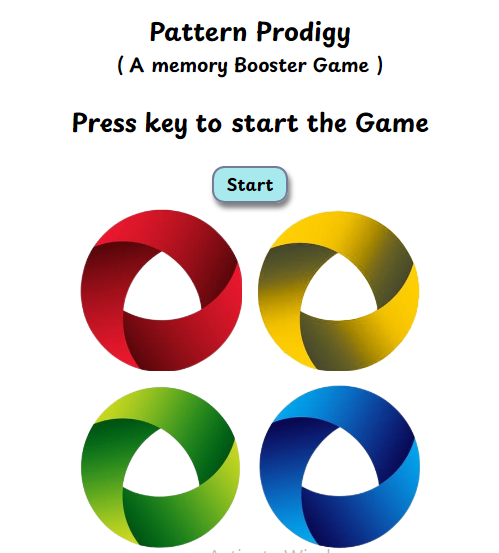

# Pattern Prodigy

Pattern Prodigy is a memory-based game inspired by the classic "Simon Says" game. Players need to remember and repeat a sequence of colors that grows longer and more complex as they advance through the levels.



## Live Link
Play the game online: [Pattern Prodigy](https://renubakshi.github.io/pattern-prodigy/)

## How to Play
1. **Watch the Sequence**: A series of colors will flash on the screen. 
2. **Memorize the Pattern**: Remember the exact order of the flashing colors.
3. **Repeat the Sequence**: Click on the colored buttons to replicate the pattern in the correct order.
4. **Next Level**: With each correct sequence, a new color will be added to the pattern, increasing the difficulty.
5. **Game Over**: If you click the wrong sequence, the game ends, and you can start again.

## Features
- Interactive and progressively challenging gameplay.
- A simple yet engaging UI.
- Responsive design for all devices.

## Tech Stack
- **HTML**: Structure of the game.
- **CSS**: Styling and animations for the game.
- **JavaScript**: Game logic and dynamic behavior.

## Installation

1. Clone the repository:

    ```bash
    git clone https://github.com/your-username/pattern-prodigy.git
    ```

2. Navigate to the project directory:

    ```bash
    cd pattern-prodigy
    ```

3. Open the `index.html` file in your browser to play the game.

## Project Structure
```bash
Pattern-Prodigy/
│
├── css/
│   └── styles.css        # CSS styles for the game
├── js/
│   └── script.js         # JavaScript logic for the game
├── index.html            # Main HTML file
└── README.md             # Project documentation
